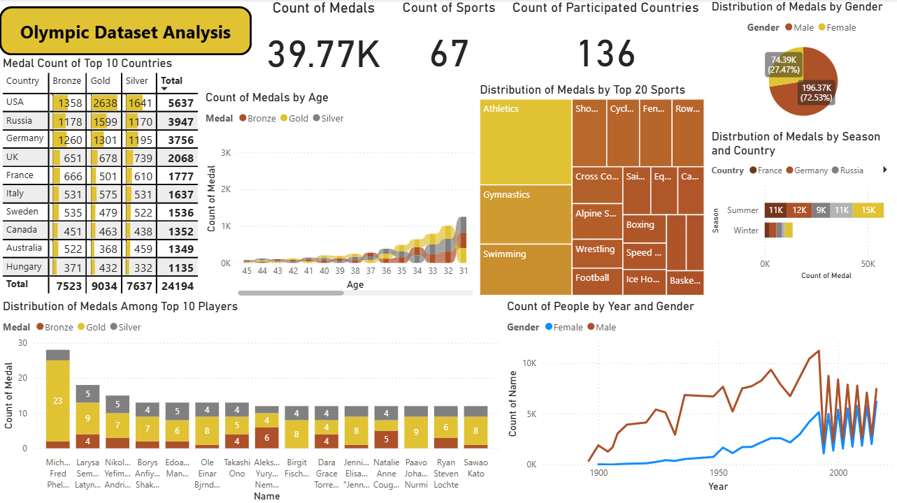

# 🏅 Olympic Dataset Analysis | Power BI Dashboard

## 📊 Project Overview

The **Olympic Dataset Analysis** Power BI dashboard provides a comprehensive visual exploration of the Olympic Games dataset — highlighting key patterns, performance insights, and historical medal distributions.
The project focuses on uncovering **how countries, athletes, genders, and sports categories** have performed over time.

---

## 🎯 Objectives

As outlined in the project goals, the analysis focuses on the following key objectives:

1. **Distribution of Medals by Gender**
   Visual comparison of male vs. female medal counts.

2. **Country of Medals**

   * Sort by total medal count
   * Apply conditional formatting for clarity

3. **Distribution of Medals Among Top 10 Players**
   Highlight the top-performing Olympic athletes and their medal counts.

4. **Distribution of Medals by Sports (Top 20)**
   Identify which sports contribute the most to total medals won.

5. **Distribution of Medals by Season and Country**
   Compare medal performance across Summer and Winter Olympics.

6. **Count of Medals by Age**
   Understand how athlete age correlates with medal-winning performance.

7. **Count of People by Year and Gender**
   Track the growth of Olympic participation across genders and years.

---

## 📁 Files Included

| File Name                                            | Description                            |
| ---------------------------------------------------- | -------------------------------------- |
| `Olympics Dataset.xlsx`                              | Source dataset used for analysis       |
| `Portfoli_Project_1  Olympics Dataset Analysis.pbix` | Power BI file containing the dashboard |
| `Dashboard_1.png`                                    | Screenshot preview of the dashboard    |
| `Objectives.txt`                                     | List of analysis objectives            |

---

## 📈 Dashboard Insights

The Power BI dashboard features multiple interactive visuals, including:

* **KPI Cards:**

  * Total Medals: `39.77K`
  * Total Sports: `67`
  * Participated Countries: `136`

* **Visuals & Charts:**

  * Medal distribution by gender, country, and sport
  * Age-based and year-wise participation trends
  * Seasonal and top-athlete comparisons

* **Key Observations:**

  * USA leads with the highest total medal count.
  * Male athletes account for ~72% of total medals.
  * Peak medal-winning age is between 28–32 years.
  * Athletics, gymnastics, and swimming dominate as top medal sports.

---

## 🧠 Tools & Technologies

* **Power BI Desktop** – Data visualization and dashboard creation
* **Excel** – Data preparation and validation
* **Data Source:** Olympic historical dataset (Kagil.com)

---

## 🚀 How to Use

1. Download the `.pbix` file.
2. Open it in **Power BI Desktop**.
3. Connect or refresh data (if necessary) using the provided Excel dataset.
4. Explore visuals interactively using slicers and filters.

---

## 🧩 Skills Demonstrated

* Data Cleaning and Transformation (Power Query)
* Data Modeling and Relationships
* DAX Calculations
* Dashboard Design and Visual Storytelling
* Insights and Performance Analysis

---

## 👤 Author

**Muhammed Thaha Uwais**
📧 Email: [Insert your email if desired]
📞 Phone: +91 6282518864
🔗 [LinkedIn Profile](https://www.linkedin.com/in/)
