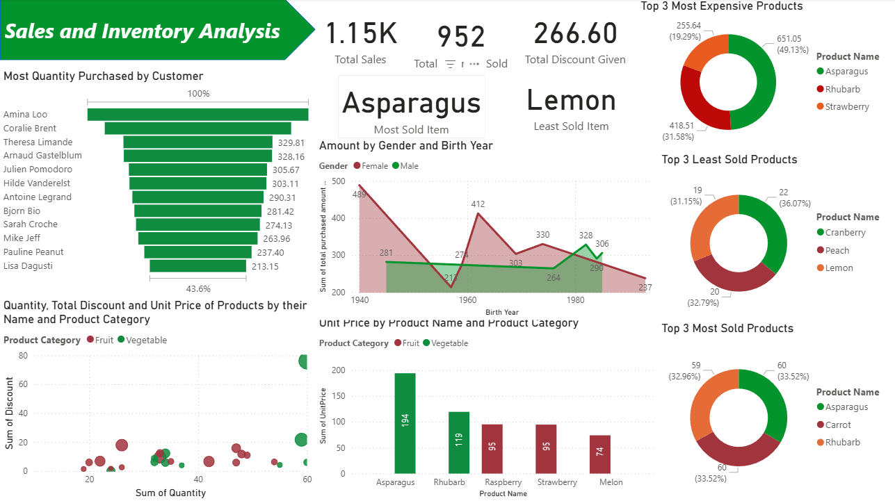

# 📊 **Sales & Inventory Analysis – Power BI Dashboard**

This Power BI project provides a comprehensive analysis of **sales performance**, **customer purchasing behavior**, and **product-level insights** using a fruit sales dataset.
The dashboard is designed to help businesses understand trends, identify top-performing products, and make data-driven decisions about pricing, inventory, and customer segmentation.

---

## 🚀 **Project Overview**

This **Sales & Inventory Analysis Dashboard** covers multiple analytical perspectives:

* Customer-level insights
* Product performance
* Unit price analysis
* Gender & age-based purchasing trends
* Best & worst selling products
* Discounts and sales metrics

It brings together all key KPIs into a single interactive report.

---

## 📌 **Key Objectives**

1. **Most Quantity Purchased by Customer**
2. **Quantity, Total Amount & Unit Price of Products** by their Name and Category
3. **Unit Price by Product Name & Product Category**
4. **Amount by Gender & Birth Year**
5. **Top 3 Least Sold Products**
6. **Top 3 Most Sold Products**
7. **Top 3 Most Expensive Products**

---

## 🧾 **Key Metrics (Cards)**

* **Total Sales**
* **Total Discount Given**
* **Total Quantity Sold**

---

## 📈 **Dashboard Insights**

### 🧍‍♂️🧍‍♀️ Customer Analysis

* Displays customers with the **highest purchase quantities**.
* Helps identify high-value customers for targeted marketing.

### 🍎 **Product Insights**

* Units sold, price variation, and discounts across **Fruit** and **Vegetable** categories.
* Visualization of the relationship between **Quantity, Discounts, and Unit Price**.

### 💰 **Pricing & Sales Performance**

* **Top 3 Most Expensive Products** highlighted using donut charts.
* **Top 3 Most Sold** and **Least Sold Products** for identifying demand patterns.

### 👨‍🦳👩 **Demographics Insight**

* Purchase amount segmented by **Gender** and **Birth Year** to study customer behavior by age group.

---

## 🛠️ **Tools & Technologies**

* **Power BI Desktop**
* **Excel Dataset**
* Data Modeling (Relationships, DAX Measures)
* Interactive Visualizations & Charts

---

## 📂 **Project Files Included**

* `.pbix` Power BI file
* Source dataset (`Fruit Sales Data - Inventory and Sales.xlsx`)
* Objective document (`Objectives.txt`)

---

## 🖼️ **Dashboard Preview**

---

## 📌 **How to Use**

1. Download the `.pbix` file from this repository.
2. Open it using **Power BI Desktop**.
3. Ensure data source paths are mapped correctly if refreshing the dataset.
4. Explore interactive visuals for detailed insights.

---

## ⭐ **If you found this project useful, consider giving it a star!**

