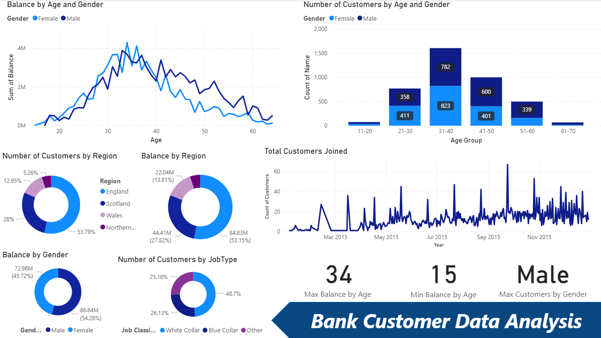

# 📊 Bank Customer Data Analysis (Power BI)

A **Power BI Dashboard** designed to analyze UK bank customer data — demographics, balances, regions, customer counts, and trends.
This repository contains the Power BI report file, dataset, objectives, and dashboard preview.

---

## 📁 Repository Contents

* 📘 **Bank Customer Data Analysis.pbix** — Power BI dashboard
* 📄 **P6-UK-Bank-Customers.csv** — source dataset
* 🖼️ **Dashboard.png** — dashboard preview
* 📝 **Objectives.txt** — list of goals and visuals included in the report

---

## 🔍 Project Overview

This dashboard provides insights into:

* 👥 **Customer demographics** — age, gender, job type
* 📍 **Regional distribution** of customers & balances
* 💰 **Balance analysis** by age, gender, and region
* 📈 **Customer acquisition trends** over time
* 🧮 **KPI cards** — max/min balance age, top customer gender

## 📈 Dashboard Insights




---

## 📊 Key Visuals in the Dashboard

* 📉 **Balance by Age & Gender**
* 📊 **Number of Customers by Age Group & Gender**
* 🥧 **Customers by Region**
* 🥧 **Balance by Region**
* 🥧 **Number of Customers by Job Type**
* 🥧 **Balance by Gender**
* 📈 **Total Customers Joined Over Time**
* 🔢 **KPI Cards** for quick insights

---

## 📂 Dataset Details

The analysis uses:
**`P6-UK-Bank-Customers.csv`**

Common fields analyzed:

* Age 👤
* Gender ⚧️
* Region 🌍
* Job Type 💼
* Balance 💰
* Join Date 📅

---

## 🚀 How to Use

1. Install **Power BI Desktop**.
2. Open the file: `Bank Customer Data Analysis.pbix`
3. Refresh or replace the dataset if needed.
4. Interact with filters & visuals to explore insights.

---

## 💡 Key Insights (Examples)

* Age **34** shows the highest balance 💰
* Male customers have the highest total count 👨‍💼
* England contributes the largest share of customers 🌍
* Customer joins show fluctuating patterns throughout 2015 📈

---

## 📌 Future Enhancements

* Add **average balance per customer**
* Include **customer segmentation** (RFM / clustering)
* Add drill-through pages for deeper insights
* Document DAX formulas in a separate file
* Export-ready summary pages for reports

---

## 📂 Project Structure

```
/ (root)
├─ Bank Customer Data Analysis.pbix
├─ P6-UK-Bank-Customers.csv
├─ Dashboard.png
├─ Objectives.txt
└─ README.md
```

---

## 👤 Author

**Muhammed Thaha Uwais**
🔗 LinkedIn: ([Add your link](https://www.linkedin.com/in/muhammed-thaha-uwais-5b5444279/))
📧 Email: (muhammedthahauwais@gmail.com)

---

## ⚖️ License

MIT license

---


